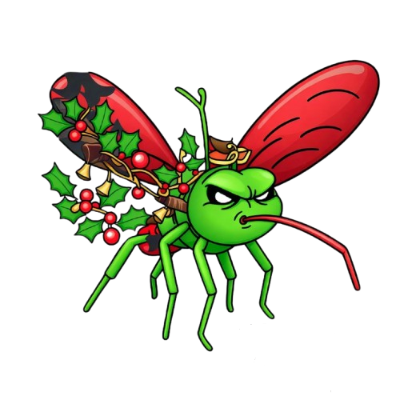

<!-- PROJECT LOGO -->
<br />
<div align="center">
  <a href="https://github.com/othneildrew/Best-README-Template">
    
  </a>

  <h3 align="center">NaMosca</h3>

  <p align="center">
    NaMosca! 🎯 Este é um jogo web desenvolvido com HTML, CSS e JavaScript, com os alunos do curso de desenvolvimento, criado para proporcionar uma experiência divertida e festiva no clima natalino. Desafie-se e entre no espírito natalino com nosso jogo e ainda elimine o mosquito!
    <br />
    <a href="https://github.com/leonardo-ggomes/mata-mosquito"><strong>Explore a documentação »</strong></a>
    <br />
    <br />
    <a href="https://leonardo-ggomes.github.io/mata-mosquito/">Jogar</a>
    ·
    <a href="https://github.com/leonardo-ggomes/mata-mosquito/issues/new?labels=bug&template=bug-report---.md">Reportar Erro</a>
    ·
    <a href="https://github.com/leonardo-ggomes/mata-mosquito/issues/new?labels=enhancement&template=feature-request---.md">Evolução</a>
  </p>
</div>


<!-- TABLE OF CONTENTS -->
<details>
  <summary>Sumário</summary>
  <ol>
    <li>
      <a href="#about-the-project">Sobre o projeto </a>
      <ul>
        <li><a href="#built-with">Construido com</a></li>
      </ul>
    </li>
  </ol>
</details>


<!-- ABOUT THE PROJECT -->
## Sobre o projeto

[![Product Name Screen Shot][product-screenshot]](https://leonardo-ggomes.github.io/mata-mosquito/)

  No NaMosca, você enfrentará desafios e missões temáticas de Natal, com um visual inspirado nas cores, nos sons e nos símbolos da época. Divirta-se coletando presentes, desviando de obstáculos e muito mais!


  - **Tema Natalino**: Visual e sons característicos do Natal.
  - **Jogabilidade Divertida**: Fácil de aprender e jogar, com desafios que vão dos mais fáceis ao mais difíceis.
  - **Para Todas as Idades**: Acessível para jogadores de todas as idades, com uma interface intuitiva.

<p align="right">(<a href="#readme-top">back to top</a>)</p>


### Construido com
* ![Javascript][Javascript]

<p align="right">(<a href="#readme-top">back to top</a>)</p>


<!-- GETTING STARTED -->
## Começar

Faça uma cópia deste projeto e comece a jogar.

### Pré-Requisito

Clique no arquivo index.html e abra no seu navegador favorito.


```sh
index.html
```


<!-- LICENSE -->
## License

Distribuido sobre a licença MIT. Veja o arquivo `LICENSE.txt` para mais informações.


[Javascript]: https://img.shields.io/badge/logo-javascript-blue?logo=javascript
[product-screenshot]: imagens/screenshot.gif
